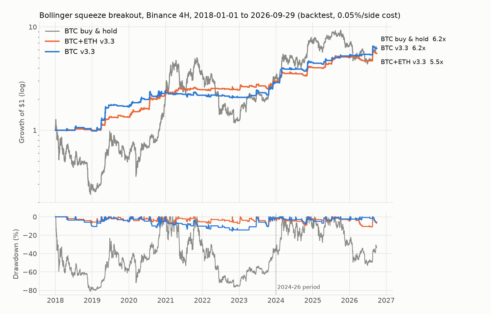

# Strategy A: Bollinger Squeeze Breakout — BTC/USDT 4H

A long-only volatility-breakout strategy for Bitcoin, built and stress-tested in Python and
deployed as a TradingView Pine Script. This page documents the rules, the bugs I found in my
own backtest, how the strategy was optimised without curve-fitting, and what it still can't do.

> **Not investment advice.** Every number below is a **backtest** on Binance spot 4-hour data
> (2018-01-01 to 2026-09-29 12:00 UTC). Backtests do not guarantee future results; the
> strategy can and did lose money over multi-month stretches.



## TL;DR

| BTC, 2020–2026 | Sharpe | CAGR | Max drawdown |
|---|---|---|---|
| **Walk-forward out-of-sample** (parameters re-picked every January using only past data) | **1.01** | 19.7% | **21.1%** |
| Fixed parameters (v3.3, chosen with hindsight) | 1.21 | 21.2% | 15.7% |
| Buy & hold | 0.91 | 43.7% | 76.6% |

The honest summary: **about buy-and-hold's risk-adjusted return, with roughly a quarter of its
drawdown, while in the market only ~13% of the time.** It does not beat buy-and-hold on raw
return in a bull market. The walk-forward row is the number I would quote; the fixed-parameter
row is flattered by hindsight.

## Strategy rules (v3.3)

Evaluated on each closed 4H candle; orders fill at the next candle's open.

**Entry (all on the same candle)**
1. Squeeze: Bollinger Band width (20, 2σ) hit its 20-bar low within the last 20 bars
2. Close crosses above the upper band
3. Band width is expanding (wider than the previous bar)
4. Volume > 1.5 × its 20-bar average
5. Close above both the 200-bar and 60-bar simple moving averages

**Exit (whichever comes first)**
- Stop-loss: entry − 2 × ATR(14), evaluated intrabar
- Trend exit: close below the 20-bar MA (the band's middle line) → sell at the next open

**Position size**: `weight = min(1, 40% / realised annualised volatility over the last 30 days)`.
No leverage; the weight never exceeds 100% of equity.

All parameters live in one file, [`markets.yaml`](../markets.yaml); a sync checker
([`check_sync.py`](../taiwan/python/check_sync.py)) fails if the Pine Script defaults drift from it.

## Full-period results (2018-01 → 2026-09, fixed parameters)

| | Sharpe | CAGR | Max DD | Trades | Profit factor | Time in market | Growth of $1 |
|---|---|---|---|---|---|---|---|
| BTC buy & hold | 0.65 | 23.2% | 81.2% | — | — | 100% | 6.2× |
| BTC v3.2 (100% equity) | 1.07 | 23.5% | 28.1% | 133 | 2.22 | 13% | 6.3× |
| **BTC v3.3 (vol-targeted)** | **1.26** | 23.1% | **15.7%** | 133 | 2.64 | 13% | 6.2× |
| ETH v3.3 (same rules) | 1.02 | 18.8% | 25.6% | 156 | 2.07 | 14% | 4.5× |
| BTC + ETH 50/50, v3.3 | 1.38 | 21.6% | 11.1% | — | — | — | 5.5× |

Sharpe uses daily returns (idle days count as 0%), annualised with √365. Costs: 0.05% per side.
Median holding time on BTC is 64 hours.

## How it got here: three changes, each tested on two coins × two periods

A change is adopted only if it improves **both BTC and ETH** in **both 2018–23 and 2024–26**.
ETH is used as a second, independent market, not something I tune for.

### 1. Replace the fixed 2R take-profit with a moving-average exit (v3.1 → v3.2)

Extending the backtest from 2024 back to 2018 revealed that the original version (take profit at
2× the stop distance) **broke even for six years**: Sharpe 0.03 on BTC in 2018–23. The fixed target
was cutting winners short. Exiting on a close below the 20-bar MA instead:

| Sharpe | BTC 2018–23 | BTC 2024–26 | ETH 2018–23 | ETH 2024–26 |
|---|---|---|---|---|
| Fixed 2R take-profit | 0.03 | 0.89 | 0.68 | −0.10 |
| **MA20 exit** | **0.88** | **1.66** | **0.97** | **0.87** |

This is a plateau, not a peak: every MA length from 10 to 100 beats the fixed target in 23 of the
24 cells (the exception: MA10 on ETH 2018–23, 0.67 vs 0.68). MA20 was chosen because it is already the Bollinger middle line
(no new parameter), not because it scored highest.

### 2. Volatility-targeted position sizing (v3.2 → v3.3)

| | BTC 2018–23 | BTC 2024–26 | ETH 2018–23 | ETH 2024–26 |
|---|---|---|---|---|
| v3.2 Sharpe / Max DD | 0.88 / 28.1% | 1.66 / 9.6% | 0.97 / 28.4% | 0.87 / 34.8% |
| **v3.3 Sharpe / Max DD** | **1.06 / 15.7%** | **1.74 / 7.2%** | **1.07 / 22.7%** | **0.92 / 25.6%** |

Lower targets give higher Sharpe monotonically (20% → BTC 1.13 / 1.78) but less return, so the
40% target is a risk-appetite choice, not an optimised value. With 10- and 30-day volatility
lookbacks all four cells improve; with 60 days, ETH 2018–23 is flat (0.96 vs 0.97).

### 3. Bug fixes (see below)

## Bugs I found in my own pipeline

| # | Bug | Effect | Fix |
|---|---|---|---|
| 1 | The data loader cached the **still-forming** last candle | A half-finished candle was stored permanently; live signals on the latest bar could be false | Keep only candles whose close time has passed ([`binance_data.py`](python/binance_data.py)) |
| 2 | Pine Script set the stop-loss one bar **after** the fill, using that bar's ATR | The first 4 hours of every trade had no stop, and the stop differed from the Python backtest | Stop is armed on the signal bar, then re-anchored to the actual fill price with the signal-bar ATR |
| 3 | The original engine filled stops at the stop price even when price **gapped through** it | Optimistic fills. Zero cases in crypto (24/7 market), but relevant to the Taiwan-equity version | New engine fills at the worse of stop and open ([`engine.py`](python/engine.py)) |
| — | Earlier: `bbw < lowest(bbw)` can never be true because `lowest()` includes the current bar | The very first version never traded | Use `<=` |

## Robustness checks ([`audit.py`](python/audit.py), [`optimize.py`](python/optimize.py))

| Check | Result |
|---|---|
| **Look-ahead**: signals recomputed on 12 truncated histories must match the full-history run | 0 mismatches on BTC and ETH |
| **Engine parity**: new engine vs. the original independent implementation | Identical trade count and PF (133 / 2.221 on BTC) |
| **Walk-forward**: 108-config grid refit every January (2020–2026), objective = the *worse* of BTC and ETH Sharpe | OOS Sharpe 1.01 BTC / 0.97 ETH vs. 1.21 / 1.17 for fixed parameters → roughly 0.2 of Sharpe was hindsight |
| **Random-entry null**: same exits, random entry bars, 500 draws | Beats 99.4% of fully random entries (BTC and ETH). Against random entries that also pass the trend filter: **88.4% on BTC** (not significant at 95%), 98.0% on ETH |
| **Costs**: 0.05% → 0.20% per side | BTC Sharpe 1.07 → 0.86 (v3.2); still positive |
| **Execution delay**: enter one bar late | BTC Sharpe 1.07 → 0.97; ETH 0.94 → 0.71 |
| **Bootstrap** (stationary block, 2,000 resamples) | BTC v3.3 Sharpe 1.26, 90% CI [0.75, 1.72]; buy & hold 0.65, CI [0.07, 1.25] |

What these say, plainly:
- The random-entry test shows that on BTC, **much of the edge comes from the trend filter and the
  exit**, not from the squeeze-breakout trigger itself.
- Every walk-forward refit picked `volume_mult = 1.0` (looser than the 1.5 in use). I did not adopt
  it because it made BTC 2024–26 worse (1.66 → 1.40); it is an open question.

## Tried and rejected

| Idea | Result |
|---|---|
| Count the breakout when the candle's **high** (not close) crosses the upper band | BTC Sharpe 0.88 → 0.68 (2018–23) and 1.66 → 1.06 (2024–26); ETH mixed (0.97 → 0.85, 0.87 → 1.15) |
| Looser volume filter (1.0× instead of 1.5×) | BTC 0.88 → 1.26 but 1.66 → 1.40; not consistent, left as an open question |
| Same rules on the 1-hour chart | BTC lower in both periods (0.67 / 0.82 vs 0.88 / 1.66); ETH mixed (0.54 / 0.91 vs 0.97 / 0.87) |
| Two-stage entry to catch "quiet cross, late volume" breakouts (e.g. 2026-09-18)¹ | Better in 2018–23, worse in 2024–26 on both coins (BTC 1.66 → 1.07, drawdown 9.6% → 20.1%) |
| Short side (mirror rules)¹ | Pure short on BTC: profit factor 0.79; removed from the code |
| Trailing stop¹ | Cuts winners: profit factor 1.44 → 1.36 |

¹ Earlier exploratory studies (not reproduced by `optimize.py`); all other numbers on this page are.

## Limitations

- **Small sample**: 133 BTC trades over 8.7 years; the confidence interval above is wide.
- **The v3.3 Pine Script has not yet been re-run on TradingView.** The Python and Pine logic are
  kept in sync, but the TradingView strategy tester numbers for v3.3 are still to be confirmed.
- Costs assume 0.05% per side with no funding (spot). Higher fees are shown in the cost table.
- Binance's history has 8 multi-hour gaps with no candles (all 2018–2020); nothing is filled in.
- Only two assets, both highly correlated; ETH is a sanity check, not an independent universe.

## Reproduce

```bash
cd crypto/python
python audit.py        # integrity checks  -> audit_output.txt
python optimize.py     # every table above -> optimize_output.txt
python report.py       # equity.png
```

Requires pandas, numpy, pyarrow, requests, pyyaml, matplotlib. Data is downloaded from Binance's
public API (no key) and cached locally.

| File | Purpose |
|---|---|
| [`strategy.pine`](strategy.pine) | TradingView strategy (v3.3) |
| [`python/engine.py`](python/engine.py) | Mark-to-market backtest engine |
| [`python/audit.py`](python/audit.py) | Look-ahead, parity, gap, cost and delay checks |
| [`python/optimize.py`](python/optimize.py) | Plateau, walk-forward, random null, sizing, portfolio, bootstrap |
| [`../taiwan/python/signals.py`](../taiwan/python/signals.py) | Signal logic, shared with the Taiwan-equity version |
| [`../markets.yaml`](../markets.yaml) | Single source of truth for all parameters |
